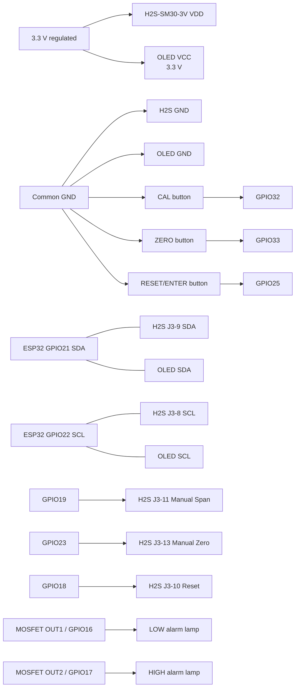

# H2SSensor — ELT H2S-SM30-3V / ESP32_MOS_X4

H2SSensor is the first project in the **Sensors** repository. It is a PlatformIO/Arduino firmware project for an **ELT Sensor H2S-SM30-3V** hydrogen sulphide sensor connected by I2C to an **ESP32_MOS_X4** four-channel MOSFET controller board.

The firmware provides a local 128×64 I2C OLED display, low/high alarm lamps, three front-panel buttons, saved calibration and alarm setpoints, rolling-average filtering, Wi-Fi setup/captive portal, web status/configuration pages, and MQTT publishing with per-tag enable flags.

> **Safety:** This project is development/prototyping firmware and is **not a certified life-safety gas detector**. H2S is acutely hazardous. Use appropriate certified detection equipment for personnel protection, follow ELT calibration instructions, use certified calibration gas/regulators, and validate alarm operation before field use.

## Hardware

- ESP32_MOS_X4 board (ESP32-WROOM-32 class)
- ELT Sensor **H2S-SM30-3V**, 3.3 V model
- SSD1306-compatible 128×64 I2C OLED, normally address `0x3C`
- 3 × normally-open momentary pushbuttons: CAL, ZERO, RESET/ENTER
- Low-alarm lamp and high-alarm lamp suitable for the MOSFET output supply/load
- 3.3 V wiring between ESP32 and ELT sensor I/O

The H2S-SM30-3V uses I2C slave address **0x72**. The ELT datasheet specifies writing ASCII `R` (`0x52`) then reading seven bytes. Firmware interprets the documented seven-byte layout as byte 0 = configuration, bytes 1–2 = H2S value, bytes 3–6 = reserved. The raw packet is also retained for diagnostics.

## ESP32_MOS_X4 pin assignment

| Function | ESP32 GPIO | Notes |
|---|---:|---|
| I2C SDA | 21 | Shared by ELT H2S sensor and OLED |
| I2C SCL | 22 | Shared by ELT H2S sensor and OLED |
| Low alarm lamp | 16 | MOSFET OUT1 |
| High alarm lamp | 17 | MOSFET OUT2 |
| Sensor SPAN control | 19 | Drives ELT manual span input, active LOW |
| Sensor ZERO control | 23 | Drives ELT manual zero input, active LOW |
| Sensor RESET control | 18 | Drives ELT reset input, active LOW |
| CAL button | 32 | Button to GND, internal pull-up |
| ZERO button | 33 | Button to GND, internal pull-up |
| RESET / ENTER button | 25 | Button to GND, internal pull-up |

Community reverse-engineering of the ESP32_MOS_X4 reports MOSFET channels OUT1..OUT4 as GPIO **16, 17, 26, 27**. This project uses OUT1 and OUT2 only.

## Wiring diagram



### Sensor side-hole J3 connections

| H2S-SM30-3V J3 | Connection |
|---:|---|
| 3 | GND |
| 4 | +3.3 V |
| 8 | I2C SCL → GPIO22 |
| 9 | I2C SDA → GPIO21 |
| 10 | Reset, active LOW → GPIO18 |
| 11 | Manual span → GPIO19 |
| 13 | Manual zero → GPIO23 |

The ELT sensor and OLED share the I2C bus. If the OLED module contains pull-ups to 5 V, **do not power it from 5 V** on this bus; use a 3.3 V-compatible OLED/pull-up arrangement.

## Button operation

Normal operation:

- **CAL**: starts the sensor manual span-calibration pulse sequence. Only use while the sensor is exposed to the calibration concentration specified for your exact H2S-SM30-3V revision.
- **ZERO**: starts the sensor manual zero-calibration pulse sequence. Only use in verified H2S-free gas/air as required by the sensor procedure.
- **RESET/ENTER**: resets the ELT sensor interface.

Setpoint mode:

1. Hold **CAL + ZERO together for 3 seconds** to enter setpoint adjustment.
2. CAL increases the selected setpoint; ZERO decreases it.
3. RESET/ENTER accepts the value and moves from LOW to HIGH setpoint.
4. Press RESET/ENTER again to save both setpoints to ESP32 flash and return to normal operation.

Setpoints, software calibration, Wi-Fi credentials, MQTT configuration, publish interval and tag enables are stored with ESP32 `Preferences` (NVS).

## Alarm filtering

The application samples H2S once per second and maintains a rolling average (default 10 samples). Alarm decisions use the filtered concentration, not the latest raw sample. A configurable hysteresis is also applied so a value close to a threshold does not chatter the lamp.

Default thresholds are intentionally placeholders and **must be set for the intended jurisdiction/site procedure before use**.

## Wi-Fi and web interface

At boot the unit creates an access point named similar to:

`H2SSensor-A1B2C3`

Open `http://192.168.4.1/` while connected to that AP. The AP remains available even if the unit successfully joins a configured Wi-Fi network, so the sensor can be commissioned or used standalone without an external network.

Web pages:

- `/` — live H2S reading, raw reading, sensor health, LOW/HIGH alarm status, setpoints, Wi-Fi and MQTT state
- `/wifi` — scan/select SSID, save credentials, disconnect/standalone mode
- `/cal` — software zero/span calibration values plus controlled ELT hardware zero/span/reset actions
- `/alarms` — low/high setpoints, hysteresis and rolling-average sample count
- `/mqtt` — broker/port/user/password, base topic, minimum publish interval
- `/tags` — enable/disable individual MQTT tags and edit their topic suffixes
- `/instructions` — quick operating instructions
- `/api/status` — JSON status endpoint

## MQTT

MQTT is optional. The minimum publish interval prevents excessive traffic even if web/status updates are faster. Each tag can be independently enabled.

Default topics are below `<baseTopic>`:

- `h2s_ppm`
- `h2s_raw_ppm`
- `alarm_low`
- `alarm_high`
- `sensor_ok`
- `low_setpoint`
- `high_setpoint`

Payloads are plain numeric/boolean values and are published retained.

## Build with PlatformIO

```bash
git clone https://github.com/homershaw/Sensors.git
cd Sensors
pio run
```

Upload using a 3.3 V USB-to-TTL adapter and the board's programming header. Power the ESP32_MOS_X4 separately if your adapter cannot safely supply the board. Typical serial wiring is adapter TX → board RX, adapter RX → board TX, and GND → GND. Hold IO0 low during reset/boot to enter the ESP32 download bootloader when required.

```bash
pio run -t upload
pio device monitor -b 115200
```

## Documentation

See [`docs/User_Manual.md`](docs/User_Manual.md) for commissioning, calibration, web/MQTT setup, alarms, troubleshooting and field-test guidance.

## Initial validation checklist

Before treating a build as validated, confirm on actual hardware:

1. I2C scan finds OLED at `0x3C` (or configured alternate address) and H2S sensor at `0x72`.
2. Raw seven-byte H2S packets change correctly when test gas is applied.
3. OLED value agrees with a known/reference instrument or ELT evaluation software.
4. OUT1 and OUT2 correspond to GPIO16/GPIO17 on your specific ESP32_MOS_X4 revision.
5. CAL/ZERO/RESET control lines idle HIGH and only pull LOW for the intended action.
6. LOW/HIGH lamps switch at the configured filtered thresholds and clear with hysteresis.
7. Setpoints survive reboot.
8. Wi-Fi AP works with no infrastructure network configured.
9. MQTT respects tag enable flags and minimum publish interval.

## License / status

Initial engineering prototype. Validate all pin mappings and sensor calibration behavior against the exact hardware revision before deployment.
