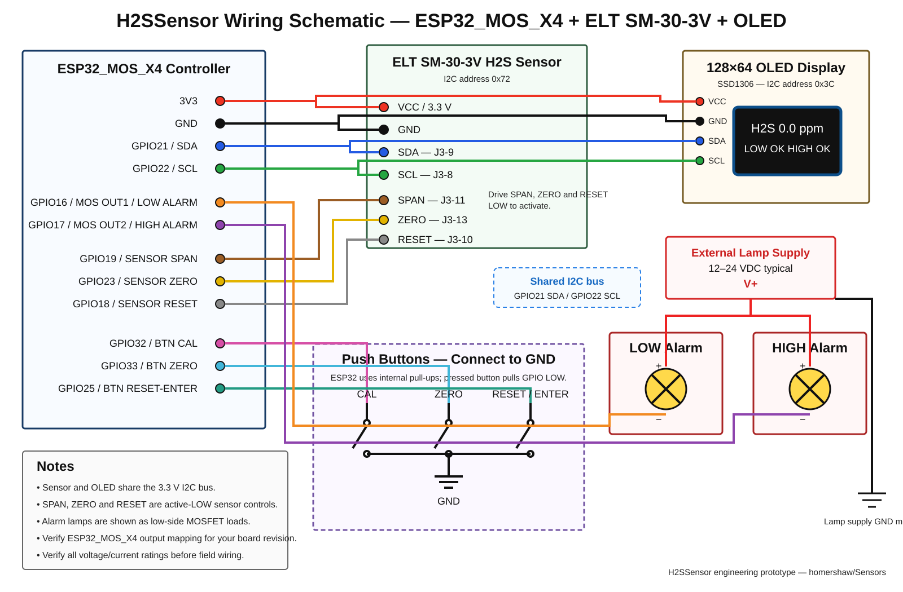

# H2SSensor — ELT H2S-SM30-3V / ESP32_MOS_X4

H2SSensor is the first project in the **Sensors** repository. It is a PlatformIO/Arduino firmware project for an **ELT Sensor H2S-SM30-3V** hydrogen sulphide sensor connected by I2C to an **ESP32_MOS_X4** four-channel MOSFET controller board.

The firmware provides a local 128×64 I2C OLED display, low/high alarm lamps, three front-panel buttons, saved calibration and alarm setpoints, rolling-average filtering, Wi-Fi setup/captive portal, web status/configuration pages, and MQTT publishing with per-tag enable flags.

> **Safety:** This project is development/prototyping firmware and is **not a certified life-safety gas detector**. H2S is acutely hazardous. Use appropriate certified detection equipment for personnel protection, follow ELT calibration instructions, use certified calibration gas/regulators, and validate alarm operation before field use.

## Hardware

- ESP32_MOS_X4 board (ESP32-WROOM-32 class)
- ELT Sensor **H2S-SM30-3V**, 3.3 V model
- SSD1306-compatible 128×64 I2C OLED, normally address `0x3C`
- 3 × normally-open momentary pushbuttons: CAL, ZERO, RESET/ENTER
- Low-alarm lamp and high-alarm lamp suitable for the MOSFET output supply/load
- 3.3 V wiring between ESP32 and ELT sensor I/O

The H2S-SM30-3V uses I2C slave address **0x72**. The ELT datasheet specifies writing ASCII `R` (`0x52`) then reading seven bytes. Firmware interprets the documented seven-byte layout as byte 0 = configuration, bytes 1–2 = H2S value, bytes 3–6 = reserved. The raw packet is also retained for diagnostics.

## ESP32_MOS_X4 pin assignment

| Function | ESP32 GPIO | Notes |
|---|---:|---|
| I2C SDA | 21 | Shared by ELT H2S sensor and OLED |
| I2C SCL | 22 | Shared by ELT H2S sensor and OLED |
| Low alarm lamp | 16 | MOSFET OUT1 |
| High alarm lamp | 17 | MOSFET OUT2 |
| Sensor SPAN control | 19 | Drives ELT manual span input, active LOW |
| Sensor ZERO control | 23 | Drives ELT manual zero input, active LOW |
| Sensor RESET control | 18 | Drives ELT reset input, active LOW |
| CAL button | 32 | Button to GND, internal pull-up |
| ZERO button | 33 | Button to GND, internal pull-up |
| RESET / ENTER button | 25 | Button to GND, internal pull-up |

Community reverse-engineering of the ESP32_MOS_X4 reports MOSFET channels OUT1..OUT4 as GPIO **16, 17, 26, 27**. This project uses OUT1 and OUT2 only.

## High-resolution wiring schematic

The diagram below is stored as an SVG vector drawing so it remains sharp when zoomed, printed, or viewed on a large monitor.



### Wiring summary

#### ELT SM-30-3V H2S sensor

| Sensor connection | ESP32 connection | Notes |
|---|---|---|
| VCC / +3.3 V | 3V3 | Do not apply 5 V to the 3.3 V sensor model |
| GND | GND | Common system ground |
| J3-9 SDA | GPIO21 | Shared I2C SDA bus |
| J3-8 SCL | GPIO22 | Shared I2C SCL bus |
| J3-11 SPAN | GPIO19 | Active LOW |
| J3-13 ZERO | GPIO23 | Active LOW |
| J3-10 RESET | GPIO18 | Active LOW |

#### OLED 128×64 SSD1306

| OLED connection | ESP32 connection |
|---|---|
| VCC | 3V3 |
| GND | GND |
| SDA | GPIO21 |
| SCL | GPIO22 |

The OLED and H2S sensor share the same I2C bus. The default addresses are different: OLED `0x3C`, H2S sensor `0x72`.

If the OLED module contains pull-ups to 5 V, **do not power it from 5 V** on this bus. Use a 3.3 V-compatible OLED and pull-up arrangement.

#### Front-panel pushbuttons

The three buttons are normally-open momentary switches connected between the assigned GPIO and GND. Firmware enables the ESP32 internal pull-ups, so an unpressed button reads HIGH and a pressed button reads LOW.

| Button | ESP32 GPIO | Function |
|---|---:|---|
| CAL | 32 | Calibration / increase setpoint |
| ZERO | 33 | Zero / decrease setpoint |
| RESET / ENTER | 25 | Reset / enter / save |

#### Low and high alarm lamps

The alarm lamps are driven by two MOSFET outputs on the ESP32_MOS_X4 board.

| Alarm | MOSFET output | GPIO |
|---|---|---:|
| LOW alarm | OUT1 | 16 |
| HIGH alarm | OUT2 | 17 |

Typical low-side wiring is:

- External lamp supply **V+** → lamp positive terminal
- LOW lamp negative terminal → MOSFET OUT1
- HIGH lamp negative terminal → MOSFET OUT2
- External lamp supply GND → common ESP32/system GND

Use a lamp supply appropriate for the installed lamps, commonly 12–24 VDC. Verify the exact ESP32_MOS_X4 MOSFET voltage/current capability before connecting field loads.


## Button operation

### Normal operation

- **CAL**: starts the sensor manual span-calibration pulse sequence. Only use while the sensor is exposed to the calibration concentration specified for your exact H2S-SM30-3V revision.
- **ZERO**: starts the sensor manual zero-calibration pulse sequence. Only use in verified H2S-free gas/air as required by the sensor procedure.
- **RESET/ENTER**: resets the ELT sensor interface.

### Setpoint adjustment

1. Hold **CAL + ZERO together for 3 seconds** to enter setpoint adjustment.
2. CAL increases the selected setpoint.
3. ZERO decreases the selected setpoint.
4. RESET/ENTER accepts the LOW setpoint and moves to HIGH.
5. Press RESET/ENTER again to save both setpoints to ESP32 flash and return to normal operation.

Setpoints, software calibration, Wi-Fi credentials, MQTT configuration, publish interval and tag enables are stored with ESP32 `Preferences` (NVS).

## Alarm filtering

The application samples H2S once per second and maintains a configurable rolling average. The default filter uses **10 samples**.

Alarm decisions use the filtered concentration rather than a single raw reading. Configurable hysteresis is also applied so temporary sensor noise or a concentration hovering around the threshold does not cause the alarm lamps to flicker or chatter.

Example behavior with a LOW alarm setpoint of 5.0 ppm and 0.5 ppm hysteresis:

- LOW alarm activates when the filtered value reaches 5.0 ppm.
- Once active, LOW alarm remains active until the filtered value falls to 4.5 ppm or below.

Default thresholds are placeholders and **must be configured for the intended jurisdiction, site, and operating procedure before use**.

## OLED display

The 128×64 SSD1306 OLED provides local indication of:

- Filtered H2S concentration
- LOW alarm condition
- HIGH alarm condition
- Sensor communication state
- Setpoint adjustment screens
- Calibration/reset status
- Wi-Fi status where appropriate

The OLED uses I2C address `0x3C` by default.

## Wi-Fi and captive portal

The unit can operate without an external Wi-Fi network.

At boot it creates an access point named similar to:

`H2SSensor-A1B2C3`

Connect a phone, tablet, or computer to the access point and browse to:

`http://192.168.4.1/`

The access point remains available even if the controller also joins a configured Wi-Fi network. This permits commissioning and local access when no infrastructure network is available.

## Web interface

The built-in web server provides:

| Page | Purpose |
|---|---|
| `/` | Live H2S reading, raw value, filtered value, sensor health, alarm state, setpoints, Wi-Fi and MQTT status |
| `/wifi` | Scan/select Wi-Fi network, save credentials, or operate standalone |
| `/alarms` | Configure LOW/HIGH setpoints, hysteresis, and rolling-average sample count |
| `/cal` | Software calibration plus controlled ELT hardware ZERO/SPAN/RESET actions |
| `/mqtt` | MQTT broker, port, username/password, base topic and minimum publish interval |
| `/tags` | Enable/disable individual MQTT tags and configure topic suffixes |
| `/instructions` | Local operating and calibration instructions |
| `/api/status` | JSON status endpoint for diagnostics/integration |

## Calibration

Two different calibration mechanisms are intentionally separated.

### ELT sensor hardware calibration

The ELT sensor exposes active-LOW ZERO and SPAN inputs. Firmware can operate these from either the physical buttons or the calibration web page.

Only perform ZERO in verified H2S-free gas/air according to the sensor procedure. Only perform SPAN using certified calibration gas at the concentration specified for the exact ELT sensor revision in use.

### Software calibration

Software zero and gain values are stored in ESP32 flash using NVS. These values can be used to align the displayed/transmitted engineering value with a known reference during development and validation.

Software calibration does not replace required sensor calibration or certified gas-detector procedures.

## MQTT

MQTT is optional and can be disabled completely.

Configuration includes:

- Enable/disable MQTT
- Broker host/IP
- Broker port
- Username
- Password
- Base topic
- Minimum publish interval
- Per-tag enable/disable flags
- Editable topic suffixes

The minimum publish interval prevents excessive traffic even though sensor sampling and web display updates may occur more frequently.

Default MQTT tags below `<baseTopic>` are:

- `h2s_ppm`
- `h2s_raw_ppm`
- `alarm_low`
- `alarm_high`
- `sensor_ok`
- `low_setpoint`
- `high_setpoint`

Payloads are plain numeric/boolean values and are published retained.

## Build with PlatformIO

Clone the repository:

```bash
git clone https://github.com/homershaw/Sensors.git
cd Sensors
```

Compile the ESP32_MOS_X4 environment:

```bash
pio run -e esp32_mos_x4
```

Upload firmware:

```bash
pio run -e esp32_mos_x4 -t upload
```

Open the serial monitor:

```bash
pio device monitor -b 115200
```

The project currently uses the PlatformIO `esp32dev` board definition as the ESP32_MOS_X4 base target. Verify flashing/programming connections and your board revision before applying field power.

## Documentation

See [`docs/User_Manual.md`](docs/User_Manual.md) for commissioning, calibration, web/MQTT setup, alarms, troubleshooting, and field-test guidance.

Additional engineering notes are in [`docs/Hardware_Notes.md`](docs/Hardware_Notes.md).

The vector wiring schematic is stored at:

[`docs/images/h2ssensor_wiring_schematic.svg`](docs/images/h2ssensor_wiring_schematic.svg)

## Initial validation gates

This project should be validated in small hardware gates rather than assuming the complete system works after compilation.

### Gate 1 — Compile

```bash
pio run -e esp32_mos_x4
```

Do not proceed until the firmware compiles without errors.

### Gate 2 — I2C hardware

Confirm an I2C scan finds:

- OLED at `0x3C`
- H2S sensor at `0x72`

### Gate 3 — Real H2S data

Confirm the raw seven-byte H2S packet is received consistently and that the interpreted concentration changes appropriately with known test gas.

### Gate 4 — Buttons and sensor controls

Verify:

- CAL button
- ZERO button
- RESET/ENTER button
- Sensor SPAN line
- Sensor ZERO line
- Sensor RESET line

All ELT control lines must idle HIGH and only pull LOW for the intended action.

### Gate 5 — Alarm outputs

Confirm OUT1 and OUT2 correspond to GPIO16 and GPIO17 on the exact ESP32_MOS_X4 board revision and that LOW/HIGH lamps operate correctly.

### Gate 6 — Filtering and setpoints

Confirm:

- Rolling-average filtering behaves as intended
- Short sensor spikes do not flicker the alarm lamps
- Hysteresis prevents threshold chatter
- LOW and HIGH setpoints save correctly
- Setpoints survive reboot

### Gate 7 — Wi-Fi and web UI

Confirm:

- Standalone access point operates with no external network
- Captive/local web interface is reachable
- Infrastructure Wi-Fi credentials save and reconnect
- Alarm/calibration/MQTT/tag pages function correctly

### Gate 8 — MQTT

Confirm:

- MQTT enable/disable works
- Broker reconnect works
- Per-tag enable flags work
- Minimum publish interval is respected
- Published values agree with the local display/web status

## Project status

Initial engineering prototype.

The firmware and documentation are intended to be validated against the physical ESP32_MOS_X4 and ELT H2S-SM30-3V hardware before any deployment decision is made.

Do **not** treat a successful compile as proof of correct gas measurement, alarm performance, electrical safety, or life-safety suitability.
